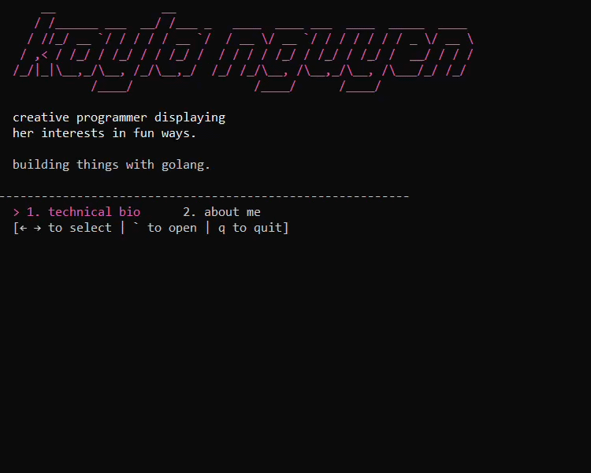
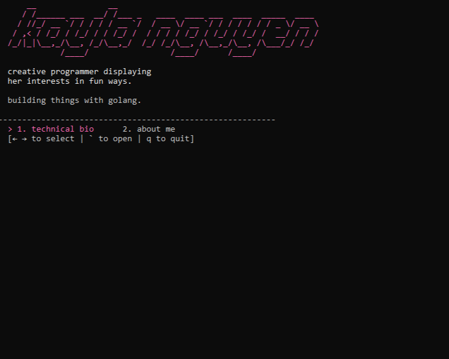
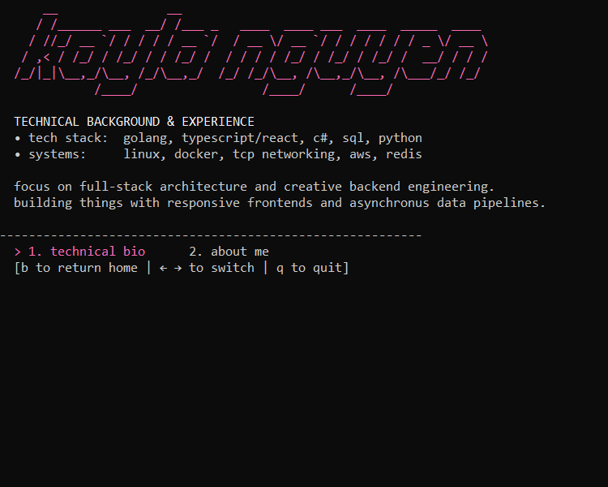
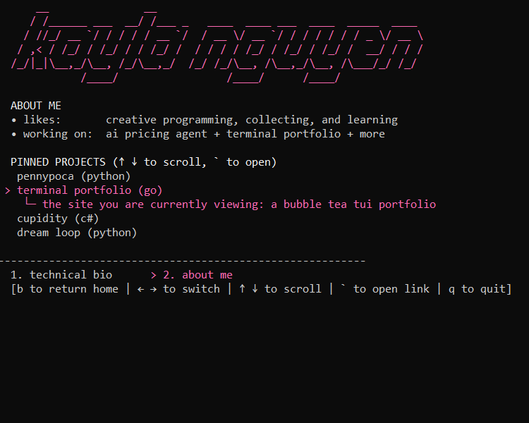

# terminal portfolio

keyboard-driven terminal user interface (TUI) portfolio that brings a personal resume straight into the terminal. built with **go** and the **bubble tea** ecosystem, incorporating ASCII text art.

## features

*   **keyboard navigation:** mouse-free interface driven by keyboard hotkeys.
*   **multi-page view:** swap between a technical overview and my personal projects.
*   **project carousel:** interactive project selector wiith embedded links.

## interface previews

  

1. main hub: landing view showcasing custom ASCII text art.
2. technical profile: core technical stack capabilities and architecture focuses.
3. pinned projects: carousel module allowing viewers to navigate through projects with immediate sub-details.

  
  
  

## terminal controls

| command key | system action performance |
| :--- | :--- |
| `←` / `→` | toggle navigation options |
| `` ` `` (backtick) | drill down into content tabs / fire browser command for selected app link |
| `↑` / `↓` | drive the cursor up and down through the pinned project layout |
| `b` | return back to the main hub |
| `q` / `ctrl+c` | exit and terminate the app |